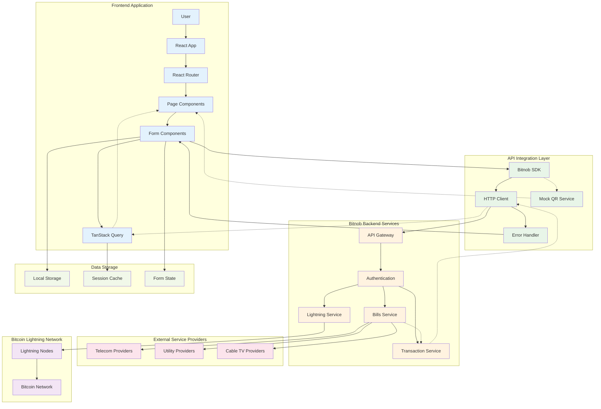

# Bitstra Technical Flow - Single Mermaid Diagram

## Main Technical Architecture Flow

```mermaid
flowchart TD
    %% Frontend Layer
    subgraph Frontend["Frontend Application"]
        User[User]
        ReactApp[React App]
        Router[React Router]
        Pages[Page Components]
        Forms[Form Components]
        State[TanStack Query]
    end

    %% API Layer
    subgraph APILayer["API Integration Layer"]
        BitnobSDK[Bitnob SDK]
        HTTPClient[HTTP Client]
        ErrorHandler[Error Handler]
        MockQR[Mock QR Service]
    end

    %% Backend Services
    subgraph Backend["Bitnob Backend Services"]
        APIGateway[API Gateway]
        AuthService[Authentication]
        BillsAPI[Bills Service]
        LightningAPI[Lightning Service]
        TransactionAPI[Transaction Service]
    end

    %% External Services
    subgraph External["External Service Providers"]
        Telecom[Telecom Providers]
        Utility[Utility Providers]
        Cable[Cable TV Providers]
    end

    %% Bitcoin Network
    subgraph Bitcoin["Bitcoin Lightning Network"]
        LightningNodes[Lightning Nodes]
        BitcoinNetwork[Bitcoin Network]
    end

    %% Data Storage
    subgraph Storage["Data Storage"]
        LocalStorage[Local Storage]
        SessionCache[Session Cache]
        FormState[Form State]
    end

    %% Main Flow Connections
    User --> ReactApp
    ReactApp --> Router
    Router --> Pages
    Pages --> Forms
    Forms --> State
    Forms --> BitnobSDK

    %% API Integration
    BitnobSDK --> HTTPClient
    HTTPClient --> APIGateway
    APIGateway --> AuthService
    AuthService --> BillsAPI
    AuthService --> LightningAPI
    AuthService --> TransactionAPI

    %% External Service Integration
    BillsAPI --> Telecom
    BillsAPI --> Utility
    BillsAPI --> Cable

    %% Lightning Network Integration
    LightningAPI --> LightningNodes
    LightningNodes --> BitcoinNetwork

    %% Error Handling
    HTTPClient --> ErrorHandler
    ErrorHandler --> Forms

    %% Data Management
    Forms --> FormState
    State --> SessionCache
    Forms --> LocalStorage

    %% Mock Services for Sandbox
    BitnobSDK -.-> MockQR
    MockQR -.-> Pages

    %% Response Flow
    BillsAPI -.-> TransactionAPI
    TransactionAPI -.-> HTTPClient
    HTTPClient -.-> State
    State -.-> Pages

    %% Styling
    classDef frontend fill:#e3f2fd
    classDef api fill:#e8f5e8
    classDef backend fill:#fff3e0
    classDef external fill:#fce4ec
    classDef bitcoin fill:#f3e5f5
    classDef storage fill:#f1f8e9

    class User,ReactApp,Router,Pages,Forms,State frontend
    class BitnobSDK,HTTPClient,ErrorHandler,MockQR api
    class APIGateway,AuthService,BillsAPI,LightningAPI,TransactionAPI backend
    class Telecom,Utility,Cable external
    class LightningNodes,BitcoinNetwork bitcoin
    class LocalStorage,SessionCache,FormState storage
```
