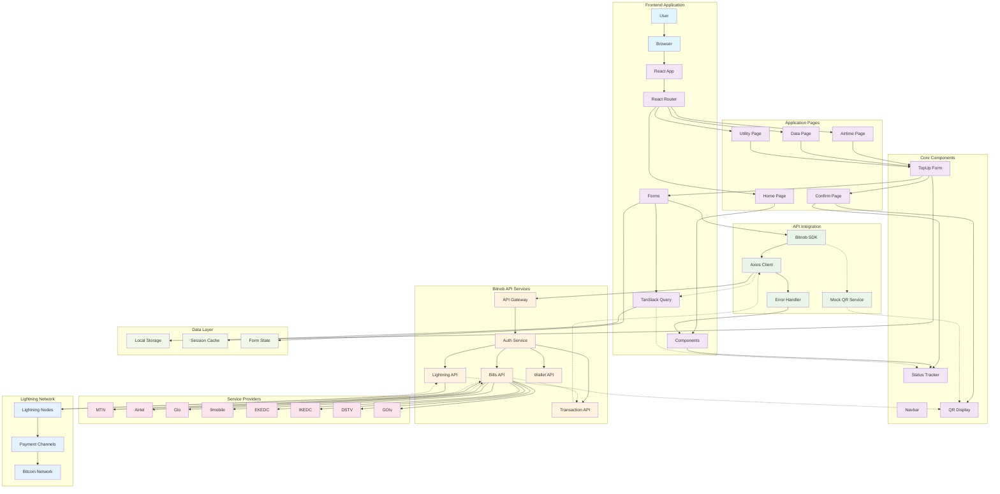
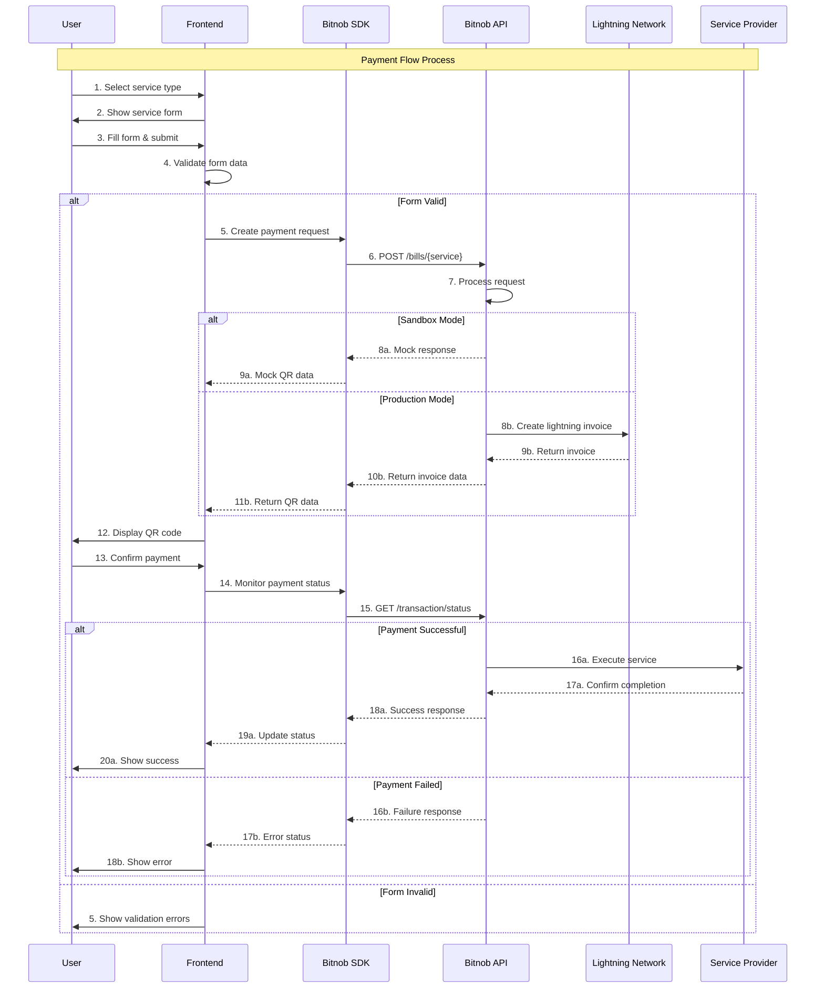
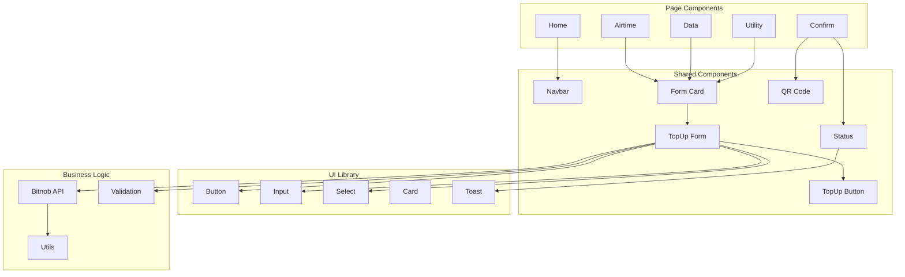

# Bitstra Technical Flow - Mermaid Diagram

## Complete Technical Architecture Flow

```mermaid
graph TB
    %% User Interface Layer
    subgraph "Frontend Application"
        User[User]
        Browser[Browser]
        ReactApp[React App]
        Router[React Router]
        Components[Components]
        Forms[Forms]
        State[TanStack Query]
    end

    %% Application Pages
    subgraph "Application Pages"
        Home[Home Page]
        Airtime[Airtime Page]
        Data[Data Page]
        Utility[Utility Page]
        Confirm[Confirm Page]
    end

    %% Core Components
    subgraph "Core Components"
        Navbar[Navbar]
        TopUpForm[TopUp Form]
        QRDisplay[QR Display]
        StatusTracker[Status Tracker]
    end

    %% API Integration Layer
    subgraph "API Integration"
        BitnobSDK[Bitnob SDK]
        HTTPClient[Axios Client]
        ErrorHandler[Error Handler]
        MockQR[Mock QR Service]
    end

    %% Bitnob Backend Services
    subgraph "Bitnob API Services"
        APIGateway[API Gateway]
        AuthService[Auth Service]
        BillsAPI[Bills API]
        LightningAPI[Lightning API]
        WalletAPI[Wallet API]
        TransactionAPI[Transaction API]
    end

    %% External Service Providers
    subgraph "Service Providers"
        MTN[MTN]
        Airtel[Airtel]
        Glo[Glo]
        NineMobile[9mobile]
        EKEDC[EKEDC]
        IKEDC[IKEDC]
        DSTV[DSTV]
        GOtv[GOtv]
    end

    %% Bitcoin Lightning Network
    subgraph "Lightning Network"
        LightningNodes[Lightning Nodes]
        PaymentChannels[Payment Channels]
        BitcoinNetwork[Bitcoin Network]
    end

    %% Data Storage
    subgraph "Data Layer"
        LocalStorage[Local Storage]
        SessionCache[Session Cache]
        FormState[Form State]
    end

    %% User Flow
    User --> Browser
    Browser --> ReactApp
    ReactApp --> Router
    Router --> Home
    Router --> Airtime
    Router --> Data
    Router --> Utility

    %% Component Interactions
    Home --> Components
    Airtime --> TopUpForm
    Data --> TopUpForm
    Utility --> TopUpForm
    TopUpForm --> Forms
    Forms --> State

    %% Navigation Flow
    TopUpForm --> Confirm
    Confirm --> QRDisplay
    Confirm --> StatusTracker

    %% API Integration Flow
    Forms --> BitnobSDK
    BitnobSDK --> HTTPClient
    HTTPClient --> APIGateway

    %% Authentication & Processing
    APIGateway --> AuthService
    AuthService --> BillsAPI
    AuthService --> LightningAPI
    AuthService --> WalletAPI
    AuthService --> TransactionAPI

    %% Service Provider Integration
    BillsAPI --> MTN
    BillsAPI --> Airtel
    BillsAPI --> Glo
    BillsAPI --> NineMobile
    BillsAPI --> EKEDC
    BillsAPI --> IKEDC
    BillsAPI --> DSTV
    BillsAPI --> GOtv

    %% Lightning Network Integration
    LightningAPI --> LightningNodes
    LightningNodes --> PaymentChannels
    PaymentChannels --> BitcoinNetwork

    %% Mock Services (Sandbox)
    BitnobSDK -.-> MockQR
    MockQR -.-> QRDisplay

    %% Data Management
    Forms --> FormState
    State --> SessionCache
    TopUpForm --> LocalStorage

    %% Error Handling
    HTTPClient --> ErrorHandler
    ErrorHandler --> Components
    Components --> StatusTracker

    %% Response Flow (dotted lines for return data)
    MTN -.-> BillsAPI
    Airtel -.-> BillsAPI
    BillsAPI -.-> TransactionAPI
    TransactionAPI -.-> HTTPClient
    HTTPClient -.-> State
    State -.-> StatusTracker
    LightningNodes -.-> LightningAPI
    LightningAPI -.-> QRDisplay

    %% Styling
    classDef userLayer fill:#e1f5fe
    classDef frontendLayer fill:#f3e5f5
    classDef apiLayer fill:#e8f5e8
    classDef backendLayer fill:#fff3e0
    classDef externalLayer fill:#fce4ec
    classDef networkLayer fill:#e3f2fd
    classDef dataLayer fill:#f1f8e9

    class User,Browser userLayer
    class ReactApp,Router,Components,Forms,State,Home,Airtime,Data,Utility,Confirm,Navbar,TopUpForm,QRDisplay,StatusTracker frontendLayer
    class BitnobSDK,HTTPClient,ErrorHandler,MockQR apiLayer
    class APIGateway,AuthService,BillsAPI,LightningAPI,WalletAPI,TransactionAPI backendLayer
    class MTN,Airtel,Glo,NineMobile,EKEDC,IKEDC,DSTV,GOtv externalLayer
    class LightningNodes,PaymentChannels,BitcoinNetwork networkLayer
    class LocalStorage,SessionCache,FormState dataLayer
```

## Data Flow Sequence

```mermaid
sequenceDiagram
    participant U as User
    participant FE as Frontend
    participant SDK as Bitnob SDK
    participant API as Bitnob API
    participant LN as Lightning Network
    participant SP as Service Provider

    Note over U,SP: Payment Flow Process

    U->>FE: 1. Select service type
    FE->>U: 2. Show service form

    U->>FE: 3. Fill form & submit
    FE->>FE: 4. Validate form data

    alt Form Valid
        FE->>SDK: 5. Create payment request
        SDK->>API: 6. POST /bills/{service}
        API->>API: 7. Process request

        alt Sandbox Mode
            API-->>SDK: 8a. Mock response
            SDK-->>FE: 9a. Mock QR data
        else Production Mode
            API->>LN: 8b. Create lightning invoice
            LN-->>API: 9b. Return invoice
            API-->>SDK: 10b. Return invoice data
            SDK-->>FE: 11b. Return QR data
        end

        FE->>U: 12. Display QR code

        U->>FE: 13. Confirm payment
        FE->>SDK: 14. Monitor payment status
        SDK->>API: 15. GET /transaction/status

        alt Payment Successful
            API->>SP: 16a. Execute service
            SP-->>API: 17a. Confirm completion
            API-->>SDK: 18a. Success response
            SDK-->>FE: 19a. Update status
            FE->>U: 20a. Show success
        else Payment Failed
            API-->>SDK: 16b. Failure response
            SDK-->>FE: 17b. Error status
            FE->>U: 18b. Show error
        end

    else Form Invalid
        FE->>U: 5. Show validation errors
    end
```

## Component Architecture

```mermaid
graph TD
    subgraph "Page Components"
        Home[Home]
        Airtime[Airtime]
        Data[Data]
        Utility[Utility]
        Confirm[Confirm]
    end

    subgraph "Shared Components"
        Navbar[Navbar]
        FormCard[Form Card]
        TopUpButton[TopUp Button]
        TopUpForm[TopUp Form]
        QRCode[QR Code]
        Status[Status]
    end

    subgraph "UI Library"
        Button[Button]
        Input[Input]
        Select[Select]
        Card[Card]
        Toast[Toast]
    end

    subgraph "Business Logic"
        BitnobAPI[Bitnob API]
        Validation[Validation]
        Utils[Utils]
    end

    Home --> Navbar
    Airtime --> FormCard
    Data --> FormCard
    Utility --> FormCard
    Confirm --> QRCode
    Confirm --> Status

    FormCard --> TopUpForm
    TopUpForm --> TopUpButton
    TopUpForm --> Input
    TopUpForm --> Select
    TopUpForm --> Button

    TopUpForm --> BitnobAPI
    TopUpForm --> Validation
    Status --> Toast

    BitnobAPI --> Utils
```
