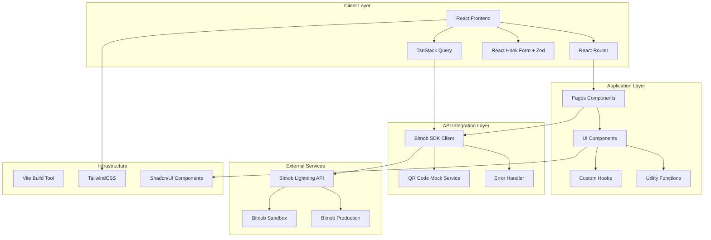
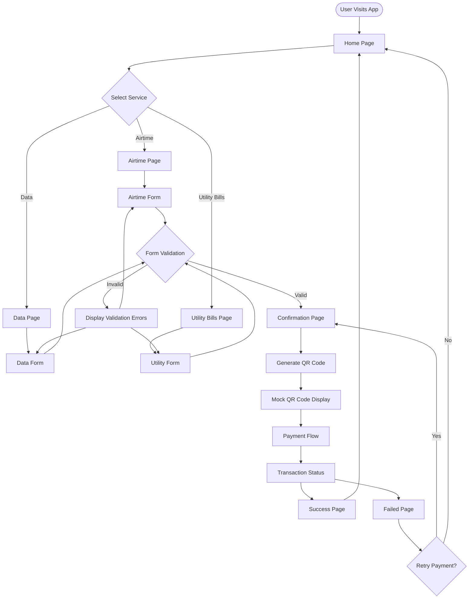
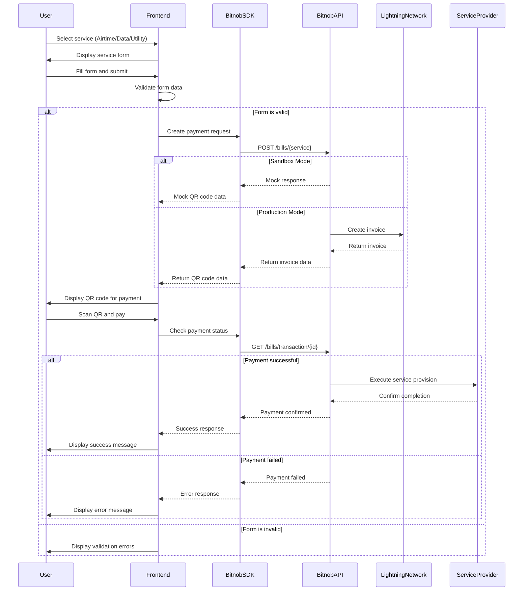
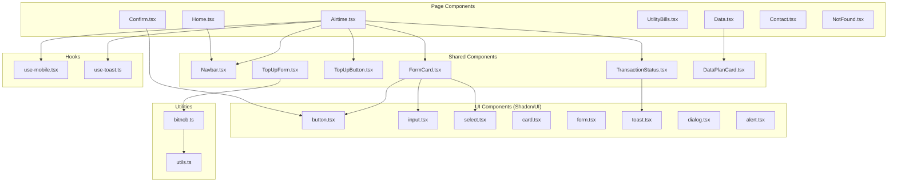
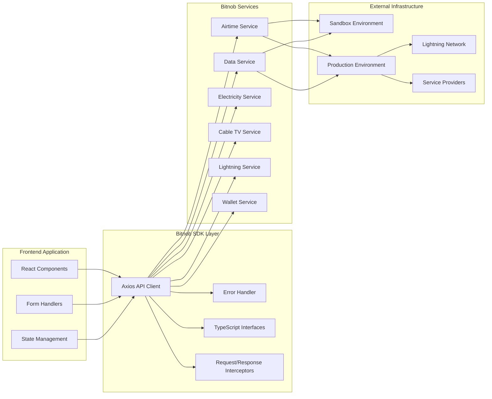
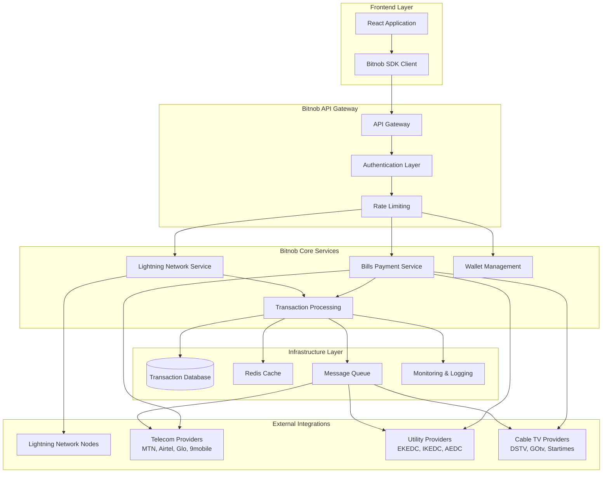
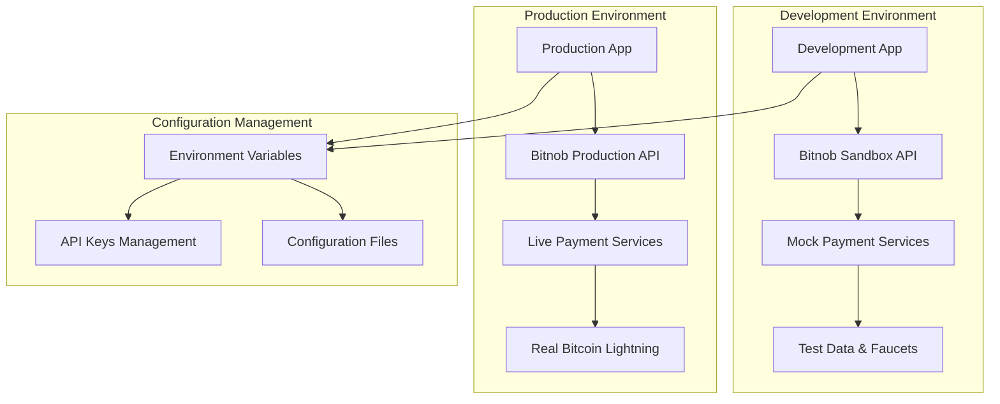
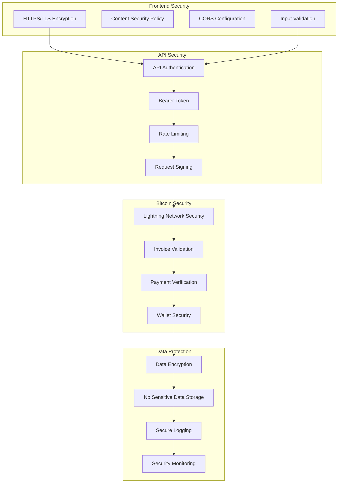
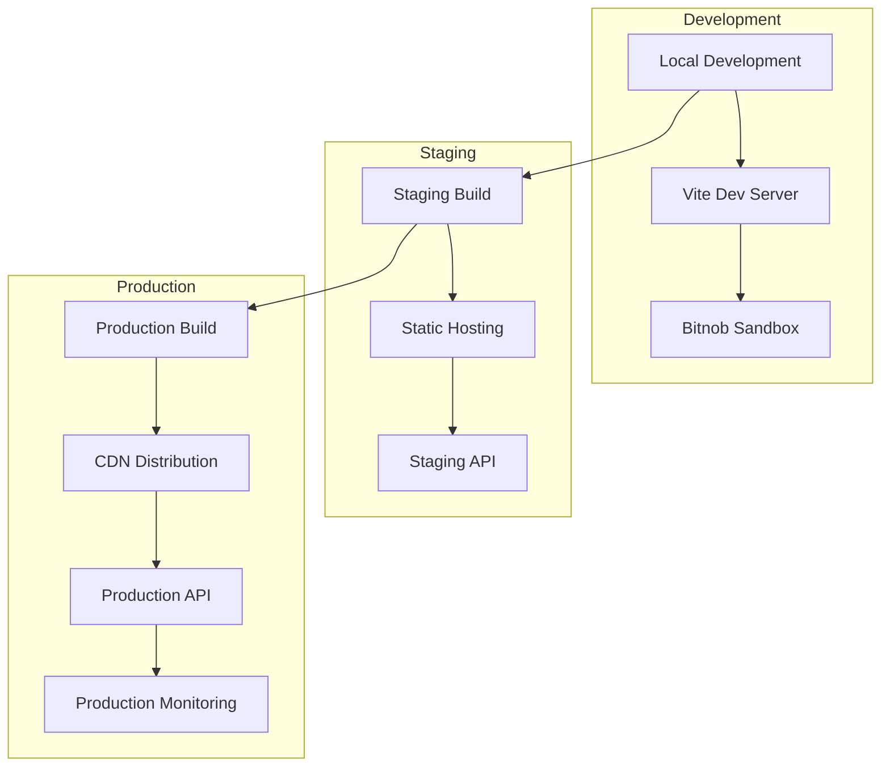

# Bitstra - Technical Architecture

## System Architecture Overview

This document outlines the technical architecture of Bitstra, a Bitcoin Lightning Network payment application that enables users to pay for airtime, data plans, and utility bills in Nigeria.

## High-Level Architecture Diagram

## Application Flow Architecture

## Data Flow Architecture

## Component Architecture

## API Integration Architecture

## Backend Integration Flow

## Environment Configuration

## Security Architecture

## Technology Stack

| Layer                   | Technology              | Purpose                                 |
| ----------------------- | ----------------------- | --------------------------------------- |
| **Frontend Framework**  | React 18 + TypeScript   | Component-based UI development          |
| **Build Tool**          | Vite                    | Fast development and build process      |
| **Styling**             | TailwindCSS + Shadcn/UI | Utility-first CSS and component library |
| **Routing**             | React Router DOM        | Client-side navigation                  |
| **State Management**    | TanStack Query          | Server state management and caching     |
| **Form Handling**       | React Hook Form + Zod   | Form validation and data handling       |
| **HTTP Client**         | Axios                   | API communication with interceptors     |
| **Payment Integration** | Bitnob SDK              | Bitcoin Lightning payment processing    |
| **QR Code Generation**  | qrcode.react            | Payment QR code display                 |
| **UI Components**       | Radix UI + Lucide React | Accessible components and icons         |

## Key Features

### Payment Processing Flow

1. **Service Selection**: User chooses airtime, data, or utility bills
2. **Form Validation**: Client-side validation using Zod schemas
3. **Payment Request**: Bitnob SDK creates payment request
4. **QR Generation**: Lightning invoice converted to QR code
5. **Payment Execution**: User scans QR and pays via Lightning wallet
6. **Status Monitoring**: Real-time payment status updates
7. **Service Delivery**: Automatic service provisioning upon payment

### Mock Implementation Notes

- **Sandbox Limitation**: Bitnob sandbox cannot decode payment requests
- **QR Code Mocking**: QR codes are generated with mock data for demonstration
- **Test Data**: Uses Nigerian Naira to Satoshi conversion rates
- **Development Mode**: Clear indicators when running in sandbox mode

## Deployment Architecture

This architecture provides a comprehensive view of how the Bitstra application is structured, from the frontend React components down to the Bitnob API integration and external service providers. The modular design ensures maintainability, scalability, and clear separation of concerns across all layers of the application.
