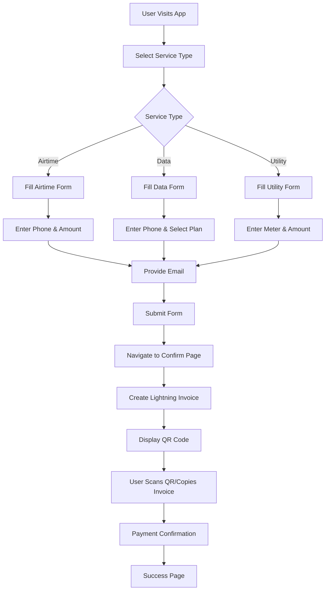

# Bitstra - Working Path & Technical Architecture Guide

## Overview

This document provides a comprehensive guide to the working path and technical architecture of **Bitstra**, a Bitcoin Lightning Network payment application for Nigerian utility services. This documentation serves as a blueprint for understanding the complete payment flow, technical implementation, and system architecture.

---

## Table of Contents

1. [Application Overview](#application-overview)
2. [Technology Stack](#technology-stack)
3. [Working Path Flow](#working-path-flow)
4. [Core Components Architecture](#core-components-architecture)
5. [API Integration Layer](#api-integration-layer)
6. [Payment Flow Implementation](#payment-flow-implementation)
7. [File Structure & Organization](#file-structure--organization)
8. [Environment Configuration](#environment-configuration)
9. [Development Workflow](#development-workflow)
10. [Production Considerations](#production-considerations)

---

## Application Overview

**Bitstra** is a Lightning Network payment application that enables users to:

- Purchase airtime for mobile networks (MTN, Airtel, Glo, 9mobile)
- Buy data bundles with various plans
- Pay utility bills (electricity, water, cable TV)
- Use Bitcoin Lightning Network for instant, low-fee payments

### Key Features

- **Real-time Lightning invoice generation** via Bitnob API
- **QR code payment interface** for Lightning wallet compatibility
- **Professional UI/UX** with clean, business-focused design
- **Form validation** with email collection for receipts
- **Payment status tracking** and confirmation system
- **Multi-service support** (airtime, data, utilities)

---

## Technology Stack

### Frontend Framework

- **React 18** with TypeScript for type safety
- **Vite** as build tool and development server
- **React Router DOM** for client-side routing

### UI & Styling

- **TailwindCSS** for utility-first styling
- **Shadcn/UI** component library for consistent design
- **Lucide React** for icons

### State Management & Forms

- **TanStack Query** for server state management
- **React Hook Form** for form handling
- **Zod** for schema validation

### Payment Integration

- **Bitnob Lightning API** for Bitcoin Lightning Network
- **QRCode.react** for generating payment QR codes
- **Axios** for HTTP requests

### Development Tools

- **ESLint** for code linting
- **PostCSS** for CSS processing
- **TypeScript** for static type checking

---

## Working Path Flow

### 1. User Journey Overview



### 2. Technical Flow Implementation

#### Step 1: Service Selection & Form Submission

- **Location**: `/src/pages/Airtime.tsx`, `/src/pages/Data.tsx`, `/src/pages/UtilityBills.tsx`
- **Process**: User fills form with service details and email
- **Validation**: Form validation using React Hook Form + Zod schemas
- **Navigation**: Form data passed via React Router state to confirmation page

#### Step 2: Payment Confirmation & Invoice Generation

- **Location**: `/src/pages/Confirm.tsx`
- **Process**:
  1. Extract form data from router state
  2. Convert Naira amount to satoshis
  3. Call Bitnob API to create Lightning invoice
  4. Display payment details and QR code
- **API Integration**: `/src/lib/bitnob.ts` handles Lightning invoice creation

#### Step 3: Lightning Payment Processing

- **QR Code Generation**: Uses `QRCode.react` to create scannable payment request
- **Payment Request Display**: Shows copyable Lightning invoice string
- **Manual Confirmation**: Users can confirm payment manually for demo purposes

#### Step 4: Payment Success

- **Location**: `/src/pages/Success.tsx`
- **Process**: Display payment confirmation with transaction details

---

## Core Components Architecture

### 1. Page Components

#### `/src/pages/Home.tsx`

- **Purpose**: Landing page with service navigation
- **Features**: Service cards for airtime, data, and utilities
- **Navigation**: Routes to respective service forms

#### `/src/pages/Airtime.tsx`

- **Purpose**: Airtime purchase form
- **Form Fields**: Phone number, amount, provider selection, email
- **Validation**: Phone format, amount limits, email validation
- **State Management**: Form state with React Hook Form

#### `/src/pages/Data.tsx`

- **Purpose**: Data bundle purchase form
- **Form Fields**: Phone number, data plan selection, provider, email
- **Features**: Dynamic plan loading based on provider
- **Integration**: Mock data plans with real API structure

#### `/src/pages/UtilityBills.tsx`

- **Purpose**: Utility bill payment form
- **Form Fields**: Meter number, amount, utility type, email
- **Features**: Meter validation, amount calculation
- **Providers**: Support for multiple utility companies

#### `/src/pages/Confirm.tsx`

- **Purpose**: Payment confirmation and Lightning invoice display
- **Features**:
  - Lightning invoice generation via Bitnob API
  - QR code display for wallet scanning
  - Payment request copy functionality
  - Manual payment confirmation
  - Error handling and retry logic

#### `/src/pages/Success.tsx`

- **Purpose**: Payment success confirmation
- **Features**: Transaction details display, navigation to home

### 2. UI Components

#### `/src/components/ui/`

- **Purpose**: Reusable UI components from Shadcn/UI
- **Components**: Button, Card, Form, Input, Select, Toast, etc.
- **Styling**: TailwindCSS with consistent design tokens

#### `/src/components/Navbar.tsx`

- **Purpose**: Application navigation header
- **Features**: Logo, navigation links, responsive design

#### `/src/components/FormCard.tsx`

- **Purpose**: Reusable form container component
- **Features**: Consistent styling, responsive layout

---

## API Integration Layer

### 1. Bitnob Integration (`/src/lib/bitnob.ts`)

#### Configuration

```typescript
// Environment-based API configuration
const SANDBOX_BASE_URL = "https://sandboxapi.bitnob.co/api/v1";
const PRODUCTION_BASE_URL = "https://api.bitnob.co/api/v1";

// API client setup with authentication
const api = axios.create({
  baseURL: isDevelopment ? SANDBOX_BASE_URL : PRODUCTION_BASE_URL,
  headers: {
    Authorization: `Bearer ${API_KEY}`,
    "Content-Type": "application/json",
  },
});
```

#### Lightning Invoice Creation

```typescript
export async function createLightningInvoice(
  amount: number,
  description: string,
  reference?: string,
  customerEmail?: string,
  expiry: number = 3600
): Promise<InvoiceResponse>;
```

**Process Flow**:

1. **Input Validation**: Amount, description, email validation
2. **API Request**: POST to `/wallets/ln/createinvoice`
3. **Response Mapping**: Map Bitnob's `request` field to `payment_request`
4. **Error Handling**: Comprehensive error catching and user feedback

#### Key Features

- **Environment Detection**: Automatic sandbox/production switching
- **Type Safety**: Full TypeScript interfaces for API responses
- **Error Handling**: Detailed error messages and logging
- **Response Mapping**: Consistent data structure regardless of API changes

### 2. Utility Functions (`/src/lib/utils.ts`)

#### Currency Conversion

```typescript
// Convert Nigerian Naira to Bitcoin satoshis
export const nairaToSatoshis = (nairaAmount: number): number => {
  // Current rate: 1 USD = 1481.21 NGN, 1 BTC = ~$96,000
  const usdAmount = nairaAmount / 1481.21;
  const btcAmount = usdAmount / 96000;
  return Math.floor(btcAmount * 100000000); // Convert to satoshis
};
```

---

## Payment Flow Implementation

### 1. Form Submission Flow

```typescript
// Example from Airtime.tsx
const onSubmit = (data: AirtimeFormData) => {
  navigate("/confirm", {
    state: {
      type: "airtime",
      recipient: data.phoneNumber,
      amount: parseFloat(data.amount),
      provider: data.provider,
      customerEmail: data.email,
      details: `${data.provider} Airtime`,
    },
  });
};
```

### 2. Lightning Invoice Generation

```typescript
// From Confirm.tsx
const createInvoice = useCallback(async () => {
  const description = `${getProductName()} payment for ${recipient}`;
  const reference = `${type}_${Date.now()}_${recipient?.replace(/\s+/g, "")}`;

  const response = await createLightningInvoice(
    totalAmountInSats,
    description,
    reference,
    customerEmail,
    3600 // 1 hour expiry
  );

  setInvoice(response.data);
}, [totalAmountInSats, recipient, provider, type, customerEmail]);
```

### 3. QR Code Display

```typescript
// QR Code generation for Lightning payment
<QRCodeSVG
  value={invoice.payment_request || invoice.request}
  size={180}
  level="M"
  includeMargin={true}
  className="mx-auto"
/>
```

---

## File Structure & Organization

```
src/
├── components/
│   ├── ui/                 # Shadcn/UI components
│   ├── Navbar.tsx         # Navigation component
│   └── FormCard.tsx       # Reusable form container
├── hooks/
│   ├── use-mobile.tsx     # Mobile detection hook
│   └── use-toast.ts       # Toast notification hook
├── lib/
│   ├── bitnob.ts          # Bitnob API integration
│   └── utils.ts           # Utility functions
├── pages/
│   ├── Home.tsx           # Landing page
│   ├── Airtime.tsx        # Airtime purchase form
│   ├── Data.tsx           # Data bundle form
│   ├── UtilityBills.tsx   # Utility payment form
│   ├── Confirm.tsx        # Payment confirmation
│   ├── Success.tsx        # Payment success
│   └── NotFound.tsx       # 404 page
├── App.tsx                # Main app component
├── main.tsx              # App entry point
└── index.css             # Global styles
```

### Key Architectural Decisions

1. **Page-based Routing**: Each service has its own page for clear separation
2. **Centralized API Logic**: All Bitnob integration in single module
3. **Shared UI Components**: Consistent design with reusable components
4. **Type Safety**: Full TypeScript coverage for API responses
5. **State Management**: Router state for form data, React Query for server state

---

## Environment Configuration

### 1. Environment Variables

```bash
# .env.development
VITE_BITNOB_API_KEY=your_sandbox_api_key
VITE_ENVIRONMENT=development

# .env.production
VITE_BITNOB_API_KEY=your_production_api_key
VITE_ENVIRONMENT=production
```

### 2. API Endpoint Configuration

```typescript
// Automatic environment detection
const isDevelopment = import.meta.env.VITE_ENVIRONMENT === "development";
const API_KEY = import.meta.env.VITE_BITNOB_API_KEY;

// Environment-specific base URLs
const baseURL = isDevelopment
  ? "https://sandboxapi.bitnob.co/api/v1"
  : "https://api.bitnob.co/api/v1";
```

---

## Development Workflow

### 1. Local Development Setup

```bash
# Install dependencies
npm install

# Start development server
npm run dev

# Build for production
npm run build

# Preview production build
npm run preview
```

### 2. Development Features

- **Hot Module Replacement**: Instant updates during development
- **TypeScript Checking**: Real-time type checking
- **ESLint Integration**: Code quality enforcement
- **Environment Switching**: Easy sandbox/production toggle

### 3. Testing Workflow

1. **Form Validation**: Test all form inputs and validation rules
2. **API Integration**: Verify Lightning invoice generation
3. **QR Code Generation**: Ensure QR codes are scannable
4. **Payment Flow**: Test complete user journey
5. **Error Handling**: Verify error states and messages

---

## Production Considerations

### 1. API Key Management

```typescript
// Secure API key handling
const API_KEY = import.meta.env.VITE_BITNOB_API_KEY;
if (!API_KEY) {
  throw new Error("Bitnob API key is required");
}
```

### 2. Error Handling Strategy

```typescript
// Comprehensive error handling
function handleBitnobError(error: AxiosError): never {
  if (error.response) {
    // Server error with response
    const errorData = error.response.data as { message?: string };
    throw new Error(errorData?.message || "Transaction failed");
  } else if (error.request) {
    // Network error
    throw new Error("Network error. Please check your connection.");
  } else {
    // Other errors
    throw new Error(error.message || "An unexpected error occurred");
  }
}
```

### 3. Production Deployment Checklist

- [ ] **Environment Variables**: Set production API keys
- [ ] **API Endpoints**: Switch to production Bitnob API
- [ ] **Error Monitoring**: Implement error tracking
- [ ] **Performance**: Optimize bundle size and loading
- [ ] **Security**: Ensure secure API key handling
- [ ] **Testing**: Full end-to-end testing with real Lightning payments

---

## Future Architecture Considerations

### 1. Scalability Enhancements

- **Database Integration**: Store transaction history and user preferences
- **User Authentication**: Implement user accounts and payment history
- **Payment Status Tracking**: Real-time payment confirmation via webhooks
- **Multi-currency Support**: Support for other cryptocurrencies

### 2. Advanced Features

- **Recurring Payments**: Automated bill payments
- **Payment Analytics**: Dashboard for payment insights
- **Mobile App**: React Native implementation
- **API Rate Limiting**: Implement request throttling

### 3. Integration Opportunities

- **Multiple Payment Providers**: Support for other Lightning service providers
- **Traditional Payment Methods**: Credit card, bank transfer fallbacks
- **Business API**: API for enterprise integrations
- **Webhook System**: Real-time payment notifications

---

## Conclusion

This working path architecture documentation provides a comprehensive understanding of the Bitstra Lightning payment application. The modular architecture, clear separation of concerns, and robust error handling make it suitable for production deployment and future enhancements.

The technical implementation leverages modern React patterns, TypeScript for type safety, and integrates seamlessly with the Bitnob Lightning API to provide a professional Bitcoin payment experience for Nigerian utility services.

---

_Last Updated: October 3, 2025_
_Version: 1.0.0_
_Environment: Development/Production Ready_
